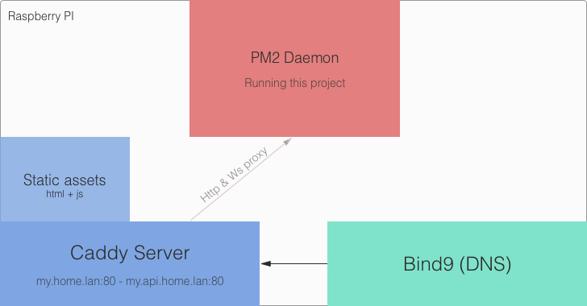

# Home Center (Server)

> This is the back-end for my [Home Assistant](https://github.com/antoinechalifour/home-center-ui).

## Install

### Prerequisites
First of all, you will need :

- An [Open Weather Map](https://openweathermap.org/) account
- A Google account

You also need:

1. to create a project on the [Google Console](https://console.developers.google.com/apis) and enable the `Calendar` API.
2. to create OAuth 2.0 credentials and download your `credentials.json` file (you may store it in the `./credentials` directory).

### Configuration

```sh
# Clone the repo
git clone https://github.com/antoinechalifour/home-center-server.git .

# Install dependencies
npm install

# Setup the environment
cp .env.sample .env
```

Then, you need to edit your `.env` file and put your configuration. In order for the Calendar widget to work, you will need to manually generate a Google `refresh_token`. I wrote a small helper script so that it's easier for you. You may run it using `node setup-scripts/google-calendar.js`.

### Run

```sh
# Then it is as simple as:
node index.js

# Or you may use pm2 to keep it running in the background
npm install -g pm2
pm2 start --name home-center-server index.js
```

## Notes

### About the project

I started this project because I wanted to:

- Learn [GraphQL](http://graphql.org/learn/). I use [Apollo](apollographql.com/docs/apollo-server/) as a GraphQL implementation, together with its [React Client library](https://www.apollographql.com/docs/react/).
- Experiment and find patterns that "felt right" with Node. I really don't like most Node.js tutorials where the logic is tight to the HTTP framework / request lifecycle.
- Get started with Home automation. For now I only own [2 Philips Hue lights](https://www2.meethue.com/fr-fr/p/hue-white-kit-de-demarrage-e27/8718696449554) but I really want to add more devices.
- Start a project that I really like, not an half-baked side project that will be forgotten in no time.

### My "production" stack



- This server is running on my Raspberry Pi.
- I use `PM2` to keep it running forever
- I setup a `bind9` DNS server on my Raspberry PI that redirect `my.home.lan` and `my.api.home.lan` to the UI & the server.
- I use [Caddy](https://caddyserver.com/) to serve http://my.home.lan and proxy http://my.api.home.lan to the node server running on `PM2`.
- I still need to configure Docker on my Raspberry Pi.
- I still need to configure my deployment process using Ansible 😄 

Feel free to ask me my configuration files as this can be quite tricky!